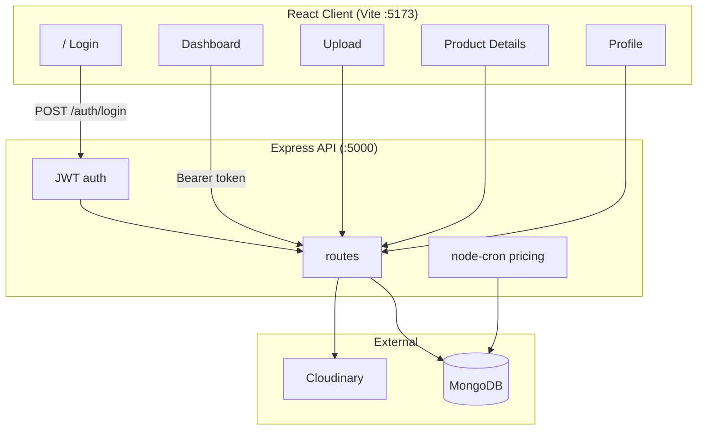

# Quantacus — Product Intelligence Dashboard

**Quantacus** is a full-stack product intelligence platform for e-commerce sellers. It ingests catalog data from **product videos** (OCR + frame analysis), **CSV bulk import**, or **manual entry**, then runs deterministic validation, title enhancement, description scoring, competitor pricing intelligence, and seller alerts — without relying on external LLM APIs for core logic.

| Layer | Stack |
|-------|--------|
| **Frontend** | React 19, Vite 6, Tailwind CSS, Radix UI, React Router, Axios |
| **Backend** | Node.js, Express 4, MongoDB (Mongoose), JWT (`jsonwebtoken`), `bcryptjs`, `node-cron` |
| **Media** | Cloudinary (videos, profile avatars, optional CSV storage) |

---

## Table of contents

1. [Features](#features)
2. [Architecture](#architecture)
3. [Repository structure](#repository-structure)
4. [Prerequisites](#prerequisites)
5. [Local setup](#local-setup)
6. [Environment variables](#environment-variables)
7. [Verify local deployment](#verify-local-deployment)
8. [API reference](#api-reference)
9. [Algorithms & business logic](#algorithms--business-logic)
   - [Video ingestion pipeline](#1-video-ingestion-pipeline)
   - [Frame extraction (FFmpeg)](#2-frame-extraction-ffmpeg)
   - [OCR (Tesseract.js)](#3-ocr-tesseractjs)
   - [AI / vision analysis (rule-based)](#4-ai--vision-analysis-rule-based)
   - [Catalog field extraction from OCR](#5-catalog-field-extraction-from-ocr)
   - [Title validation](#6-title-validation)
   - [Enhanced title generation](#7-enhanced-title-generation)
   - [Description quality scoring](#8-description-quality-scoring)
   - [Overall product quality score](#9-overall-product-quality-score)
   - [CSV parsing & validation](#10-csv-parsing--validation)
   - [Competitor pricing intelligence](#11-competitor-pricing-intelligence)
   - [Alerts](#12-alerts)
13. [Authentication & per-user data](#authentication--per-user-data)
14. [Frontend application](#frontend-application)
15. [Troubleshooting](#troubleshooting)
16. [Production notes](#production-notes)

---

## Features

### Ingestion & catalog

- **Video upload** → Cloudinary → async job: frames → OCR → catalog fields → validation → alerts
- **CSV bulk import** with header validation, per-row scoring, partial success
- **Manual product entry** without video or CSV
- **Product details** — OCR preview before save; saved catalog after save
- **Deterministic title enhancement** from saved fields only (brand, category, color, size, material)
- **Title source toggle** — original vs enhanced listing title (persisted in DB)

### Pricing & reports

- **Competitor pricing dashboard** — simulated marketplace prices, analytics, recommendations
- **Auto competitor refresh** — server cron every **1 minute** + product page auto-refresh every **60s** (manual refresh has 60s cooldown)
- **Product report download** — CSV (or JSON) with catalog, validation, competitor table, alerts

### Auth & accounts

- **JWT authentication** — register, login, Bearer token on all protected routes
- **Login-first UX** — `/` is the sign-in page; dashboard and app routes require authentication
- **Per-user workspace** — products, jobs, dashboard metrics, and alerts scoped to the signed-in seller
- **Profile page** — view stats, edit name, upload profile picture (Cloudinary)
- **Forgot / reset password** — token-based reset flow (reset link logged in dev; email integration ready)

### Operations

- **Dashboard** — quality summary for **your** products only
- **Jobs & alerts** — only records tied to your account
- **Per-seller SKU uniqueness** — same `sku_id` in CSV can be used by different accounts (compound index on `skuId` + `createdBy`)

---

## Architecture



**Protected routes:** All `/api/*` endpoints except `/health`, `/auth/register`, `/auth/login`, `/auth/forgot-password`, and `/auth/reset-password` require `Authorization: Bearer <token>`.

**Request flow (video):**

1. Client uploads video → `POST /api/upload-video` → Multer + Cloudinary → `Job` document created (`PENDING`).
2. `enqueueJob` runs `jobProcessor.processVideoExtractionJob` in the background (`setImmediate`).
3. Job downloads video, extracts 3 JPEG frames, runs OCR, rule-based “AI” analysis, builds product draft, validates, saves `Product`, creates `ProductIssue` + `Alert` records.
4. Client polls `GET /api/jobs/:id` until `COMPLETED`, then navigates to `/products/:productId`.

---

## Repository structure

```
Quantacus/
├── client/                 # React + Vite frontend
│   ├── public/             # favicon.svg, static assets
│   ├── src/
│   │   ├── context/        # AuthContext, AppContext
│   │   ├── pages/          # Login, Dashboard, Profile, Upload, …
│   │   ├── services/       # api.js (JWT interceptor), product, auth, …
│   │   └── components/     # auth/ProtectedRoute, product, upload
│   └── vite.config.js      # proxy /api → localhost:5000
├── server/
│   ├── src/
│   │   ├── config/         # env, db (index sync), cloudinary
│   │   ├── controllers/    # auth, product, upload, dashboard, …
│   │   ├── jobs/           # jobProcessor, competitorRefreshCron
│   │   ├── middlewares/    # auth, upload (video/csv/avatar), errors
│   │   ├── models/         # User, Product, Job, Alert, …
│   │   ├── routes/         # auth public + protected app routes
│   │   ├── services/       # OCR, CSV, pricing, productReport, …
│   │   └── utils/          # ownership.js, jwt.js, ffmpeg, …
│   └── temp/               # per-job video + frame files (gitignored)
├── package.json            # root scripts: install:all, dev:server, dev:client
└── README.md
```

---

## Prerequisites

Install the following before running locally:

| Requirement | Version / notes |
|-------------|-----------------|
| **Node.js** | 18.x or 20.x LTS recommended |
| **npm** | 9+ (comes with Node) |
| **MongoDB** | Atlas cluster or local `mongod` |
| **Cloudinary account** | Needed for **video upload** and **profile pictures**; CSV/manual entry work without it |
| **Disk space** | Temp folder `server/temp/` stores downloaded videos and frames during jobs |

> **Note:** FFmpeg and FFprobe are bundled via `ffmpeg-static` and `ffprobe-static` npm packages — you do **not** need a system FFmpeg install for frame extraction.

---

## Local setup

### 1. Clone and install dependencies

```bash
cd Quantacus
npm run install:all
```

This runs `npm install` in both `server/` and `client/`.

### 2. Configure environment

**Server** — copy and edit:

```bash
cp server/.env.example server/.env
```

**Client** — for local development (API proxied through Vite):

```bash
cp client/.env.example client/.env
```

Set in `client/.env`:

```env
VITE_API_URL=https://product-intelligence-dashboard-3n1d.onrender.com/api
```


### 3. MongoDB

- Create a database (e.g. `product-intelligence`) in [MongoDB Atlas](https://www.mongodb.com/cloud/atlas) or run MongoDB locally.
- Paste the connection string into `server/.env` as `MONGODB_URI`.

### 4. Cloudinary (video & avatars)

1. Open [Cloudinary Console](https://console.cloudinary.com/) → **Programmable Media** → **API Keys**.
2. Copy **Cloud name**, **API Key**, and **API Secret** into `server/.env`.
3. Ensure `CLIENT_URL=http://localhost:5173` matches your frontend origin (CORS).

### 5. Start backend and frontend

**Terminal 1 — API:**

```bash
npm run dev:server
```

Expected log: `Server running on port 5000 (development)`

**Terminal 2 — UI:**

```bash
npm run dev:client
```

Open **http://localhost:5173**

### 6. Optional — seed demo data

```bash
npm run seed
```

Creates a demo user (`demo@quantacus.local` / `demo123`), sample products (owned by that user), jobs, alerts, and competitor prices.

**After schema changes:** Restart the server once so MongoDB syncs indexes (e.g. per-user SKU). Look for `[db] Dropped legacy global SKU index` in logs if upgrading an existing database.

---

## Environment variables

### Server (`server/.env`)

| Variable | Required | Description |
|----------|----------|-------------|
| `NODE_ENV` | No | `development` or `production` |
| `PORT` | No | API port (default `5000`) |
| `CLIENT_URL` | Yes | Frontend origin for CORS (e.g. `http://localhost:5173`) |
| `MONGODB_URI` | Yes | MongoDB connection string |
| `CLOUDINARY_CLOUD_NAME` | Yes* | Cloudinary cloud name |
| `CLOUDINARY_API_KEY` | Yes* | Cloudinary API key |
| `CLOUDINARY_API_SECRET` | Yes* | Cloudinary API secret |
| `JWT_SECRET` | Yes | Secret for signing JWT access tokens |
| `JWT_EXPIRES_IN` | No | Token lifetime (default `7d`) |
| `MAX_FILE_SIZE_MB` | No | Max upload size (default from env config) |

\* Required for video upload and profile avatars. CSV and manual entry work without Cloudinary.

### Client (`client/.env`)

| Variable | Description |
|----------|-------------|
| `VITE_API_URL` | API base URL. Use `/api` locally with Vite proxy, or full URL in production |

---

## Verify local deployment

Use this checklist to confirm everything works:

| Step | Action | Expected result |
|------|--------|-----------------|
| 1 | `curl http://localhost:5000/api/health` | `{"success":true,"message":"API is running"}` |
| 2 | Register at `/register` or run `npm run seed` and sign in with `demo@quantacus.local` / `demo123` | Login succeeds; dashboard loads |
| 3 | Open http://localhost:5173 | Dashboard loads (redirects to login if not signed in) |
| 4 | **Upload → Manual entry** → fill title, brand, category, price, MRP → Create | Redirects to product page; saved details visible |
| 5 | On product page, **Competitor pricing** section | Table with Flipkart + 6 competitors; auto-refreshes every 1 min |
| 6 | **Download report** on product page | CSV file downloads with full product intelligence |
| 7 | **Enhance title** (after manual save) | Enhanced title card appears; toggle Original/Enhanced |
| 8 | **Upload → Products CSV** with valid headers | Import summary with valid/invalid row counts |
| 9 | **Upload → Product Video** (short MP4, visible text/labels) | Job completes; product created with OCR extraction table |
| 10 | **Jobs** page | Only your video/CSV jobs listed |
| 11 | **Alerts** page | Alerts for your products only |
| 12 | **Profile** — upload photo, edit name | Avatar in navbar; stats show your counts |
| 13 | **Forgot password** at `/forgot-password` | Dev: reset link in UI + server console |
| 14 | Second account — upload **same CSV** as another user | Imports succeed (SKU unique per seller, not global) |

**Sample CSV headers (required):**

```csv
sku_id,product_title,brand,category,price,mrp,availability,description,color,material,size
SKU-001,Nike Air Zoom Running Shoes,Nike,Running Shoes,2999,3999,in_stock,Lightweight mesh upper for daily runs,Blue,Mesh,M
```

---

## API reference

Base URL: `http://localhost:5000/api` (or `/api` via Vite proxy)

### Health

| Method | Path | Description |
|--------|------|-------------|
| `GET` | `/health` | API health check |

### Auth

| Method | Path | Auth | Body / notes |
|--------|------|------|----------------|
| `POST` | `/auth/register` | Public | `{ name, email, password }` → `{ user, stats, token }` |
| `POST` | `/auth/login` | Public | `{ email, password }` → `{ user, stats, token }` |
| `POST` | `/auth/forgot-password` | Public | `{ email }` — in dev, response may include `resetUrl` |
| `POST` | `/auth/reset-password` | Public | `{ token, password }` → logs in with new JWT |
| `GET` | `/auth/me` | Bearer | Profile + stats (`productCount`, `jobCount`, `openAlerts`) |
| `PATCH` | `/auth/profile` | Bearer | `{ name }` |
| `POST` | `/auth/profile/avatar` | Bearer | `multipart/form-data` field **`avatar`** (jpg/png/webp/gif, max 5MB) |

All other `/api/*` routes require `Authorization: Bearer <token>`.

### Upload

| Method | Path | Body | Description |
|--------|------|------|-------------|
| `POST` | `/upload-video` | `multipart/form-data` field `video` | Upload video to Cloudinary; returns `jobId` |
| `POST` | `/upload-products-csv` | `multipart/form-data` field `csvFile` | Parse, validate, import CSV rows |

### Jobs

| Method | Path | Description |
|--------|------|-------------|
| `GET` | `/jobs` | List **your** jobs (`createdBy`) |
| `GET` | `/jobs/:id` | Job detail (403 if not yours) |

### Products

| Method | Path | Description |
|--------|------|-------------|
| `GET` | `/products` | List **your** products (`createdBy`) |
| `POST` | `/products` | Create product (manual entry); sets `createdBy` |
| `GET` | `/products/:id` | Full details (404 if not yours) |
| `PATCH` | `/products/:id` | Update catalog fields; sets `manualFieldsSaved` |
| `POST` | `/products/:id/enhance-title` | Generate enhanced title (requires manual save) |
| `PATCH` | `/products/:id/title-source` | Body: `{ "source": "original" \| "enhanced" }` |
| `GET` | `/products/:id/report?format=csv` | Download product intelligence report (CSV or `format=json`) |
| `GET` | `/products/:id/competitor-prices` | Raw competitor price documents |

### Competitor pricing

| Method | Path | Description |
|--------|------|-------------|
| `POST` | `/competitor-prices/refresh/:productId` | Regenerate simulated competitor prices |
| `GET` | `/competitor-prices/:productId` | Pricing payload (analytics + recommendation) |

### Dashboard & alerts

| Method | Path | Description |
|--------|------|-------------|
| `GET` | `/dashboard/quality-summary` | Metrics for **your** products/issues/alerts only |
| `GET` | `/alerts` | Alerts for **your** products only |

---

## Algorithms & business logic

All scoring and enhancement described below is **deterministic** (rule-based). No OpenAI/Gemini calls are made in the current implementation. The `runAiAnalysis` step uses OCR text and filename heuristics only.

**Primary source files:**

| Concern | Location |
|---------|----------|
| Video job pipeline | `server/src/jobs/jobProcessor.js` |
| Frame extraction | `server/src/services/frameExtractionService.js`, `server/src/utils/ffmpegUtils.js` |
| OCR | `server/src/services/ocrService.js`, `server/src/utils/ocrTextUtils.js` |
| Catalog extraction | `server/src/utils/catalogFieldExtraction.js` |
| Title validation | `server/src/validators/titleValidator.js` |
| Title generation | `server/src/services/titleGenerationService.js` |
| Description quality | `server/src/utils/descriptionQuality.js` |
| Product validation | `server/src/services/validationService.js` |
| CSV | `server/src/validators/csvValidator.js`, `server/src/services/csvProcessingService.js` |
| Competitor pricing | `server/src/services/competitorPricingService.js` |
| Pricing cron | `server/src/jobs/competitorRefreshCron.js` |
| Product report export | `server/src/services/productReportService.js` |
| Auth & JWT | `server/src/controllers/authController.js`, `server/src/middlewares/auth.js`, `server/src/utils/jwt.js` |
| Per-user access | `server/src/utils/ownership.js` |
| User model | `server/src/models/User.js` |

---

### 1. Video ingestion pipeline

**Entry:** `POST /api/upload-video` → `uploadController.uploadVideo` → `Job` type `VIDEO_EXTRACTION` → `enqueueJob` → `jobProcessor.processVideoExtractionJob`.

**Progress stages:**

| Progress | Stage |
|----------|--------|
| 10% | Job marked `RUNNING` |
| 30% | Frame extraction |
| 45% | OCR on all frames |
| 60% | AI / vision analysis |
| 75% | Build product + validation |
| 90% | Generate alerts |
| 100% | `COMPLETED`; `metadata.productId` set |

**Output product:**

- Draft catalog fields via `buildProductFromVideoAnalysis` (see §5).
- Initial `qualityScore` = `(filledFields / 11 catalog fields) × 100` (11 fields in `CATALOG_FIELDS`).
- `extractedAttributes.manualFieldsSaved` is **false** until user saves via PATCH — OCR view stays visible until then.
- `skuId` defaults to `PENDING-{jobId}` if not detected.

**Cleanup:** `cleanupJobTemp(jobId)` deletes `server/temp/videos/` and `server/temp/frames/` for that job in a `finally` block.

---

### 2. Frame extraction (FFmpeg)

**File:** `frameExtractionService.js`, `ffmpegUtils.js`

1. Download video from Cloudinary URL to `server/temp/videos/{jobId}.mp4`.
2. **Duration** via `ffprobe` (`getVideoDuration`).
3. Extract **3 keyframes** at **20%, 50%, and 80%** of duration (`getKeyframeTimestamps`).
4. Each frame saved as JPEG (`frame1.jpg`, `frame2.jpg`, `frame3.jpg`) at width **640px** (`-q:v 4` quality).
5. Timeouts: ffprobe 30s, per-frame extract 90s.

Frame metadata stored on product: `extractedAttributes.frameTimestamps`, `frameCount`, `duration`.

**UI frames:** `productDetailsSerializer.js` builds preview URLs via Cloudinary transformation (`getFrameImageUrl(videoPublicId, seconds)`), or falls back to 20/50/80% of duration if timestamps missing.

---

### 3. OCR (Tesseract.js)

**File:** `ocrService.js`

- Engine: **Tesseract.js** worker, language `eng`, shared worker per batch.
- Each frame: `worker.recognize(path)` with **60s timeout** per frame.
- On failure: frame marked `partial = true`, empty text, confidence `0`.

**Post-processing (`ocrTextUtils.js`):**

| Function | Logic |
|----------|--------|
| `cleanOcrText` | Strip garbage symbols, normalize whitespace, dedupe lines |
| `deduplicateWords` | Remove consecutive duplicate words (case-insensitive) |
| `mergeFrameTexts` | Merge all frame texts; dedupe lines globally |
| `detectBrandNames` | Regex: capitalized tokens 2+ chars; filter packaging noise |
| `detectPackagingKeywords` | Match list: NEW, SALE, OFF, LIMITED, ORGANIC, etc. |

**Aggregates:**

- `combinedText` — merged deduplicated text across successful frames.
- `overallConfidence` — arithmetic mean of per-frame Tesseract confidence scores.
- `partial` — true if any frame failed or file missing.

---

### 4. AI / vision analysis (rule-based)

**File:** `videoAnalysis.js` — `runAiAnalysis`

This is **not** a neural vision API. It structures OCR results:

- `suggestedCategory`: regex on OCR + filename → `Apparel`, `Electronics`, or `General`.
- `suggestedBrand`: first entry from `detectedBrands`.
- `packagingKeywords`: from OCR utils.
- `frameInsights`: per-frame OCR snippet + confidence.
- `confidence`: `min(0.95, overallConfidence / 100)`.

Designed as a swap-in point for OpenAI Vision / Gemini later.

---

### 5. Catalog field extraction from OCR

**File:** `catalogFieldExtraction.js` — `extractCatalogFieldsFromOcr`

Regex and heuristic extraction from `combinedText`:

| Field | Detection method |
|-------|------------------|
| `skuId` | `SKU-XXXX` in text or filename |
| `title` | First substantial line (>8 chars, not SKU/URL); else filename (title-cased) |
| `description` | First 3 lines joined (max 500 chars) |
| `brand` | OCR `detectedBrands[0]` or `suggestedBrand` |
| `category` | AI suggestion if not General; else apparel/electronics keyword match |
| `price` | `₹` / `Rs` / `INR` amount pattern |
| `mrp` | `MRP:` followed by currency amount |
| `availability` | `out of stock`, `limited`, `in stock` phrases |
| `color` | Named colors (black, white, red, …) |
| `size` | XXS–XXXL or numeric cm/inch |
| `material` | cotton, polyester, leather, mesh, etc. |

Only fields with successful matches are added to `filledFields`. Missing fields tracked via `getMissingCatalogFields`.

---

### 6. Title validation

**File:** `validators/titleValidator.js` — `validateTitle(title, { brand, category, productType })`

Starts at **score = 100**, subtracts penalties, clamps 0–100. **`isWeak`** if score **< 60**.

| Rule | Penalty | Issue message |
|------|---------|---------------|
| Length < 15 chars OR < 3 words | −30 | Title is too short |
| Brand provided but not substring of title | −20 | Missing brand information |
| Category/type provided but not in title | −25 | Lacks product type information |
| Any word repeated | −15 | Contains repeated words |
| Generic terms ≥50% of words, or ≥2 generic in ≤3 words | −20 | Lacks meaningful product information |

**Generic terms:** `best`, `awesome`, `premium`, `amazing`, `product`, `item`.

Used in: `validationService`, CSV row validation, and post-generation check on enhanced titles.

---

### 7. Enhanced title generation

**File:** `titleGenerationService.js` — `generateEnhancedTitle(product)`

**Input policy:** Only **saved** product document fields (`brand`, `color`, `category`, `size`, `material`, `title`). Ignores `extractedAttributes` OCR/AI. Placeholder titles (`Pending Review`, `extracted product`) treated as empty.

**Assembly order (`buildTitleParts`):**

1. Brand (title case)
2. Color (title case)
3. Category (title case)
4. Size → `Size {value}` or `Size M` formatting
5. Material → phrase map (`mesh` → `with Mesh Upper`, `cotton` → `Made from Cotton`, …) via `formatMaterialPhrase`

Parts joined with spaces → `dedupeWords` → `truncateTitle(..., 90)`.

**Fallback** if no parts: `Brand + Category`, or brand alone, or category alone, or original title, or `"Generic Product"`.

**Keywords (`generateKeywords`):** Up to 8 tokens/phrases from category, color+category, material, size+category, brand (min length 3; filters stop words).

**Gate:** `POST /products/:id/enhance-title` requires `extractedAttributes.manualFieldsSaved === true`.

**Title toggle:** `PATCH /products/:id/title-source` swaps `product.title` between `savedOriginalTitle` and `enhancedTitle`.

---

### 8. Description quality scoring

**File:** `descriptionQuality.js` — `analyzeDescriptionQuality(description)`

Starts at **100**. **`isWeak`** if score **< 60**.

| Rule | Penalty | Issue |
|------|---------|-------|
| Normalized length < 30 | −30 | Description is too short |
| Word count < 8 | −20 | Lacks sufficient detail |
| Any word appears > 4 times | −15 | Excessive repeated words |
| ≥2 fluff words | −15 | Generic marketing terms |

**Fluff words:** `best`, `awesome`, `amazing`, `premium`.

---

### 9. Overall product quality score

**File:** `validationService.js` — `validateProduct(product)`

Starts at **100**. Applies penalties (clamped 0–100):

| Check | Penalty (typical) | Severity |
|-------|-------------------|----------|
| Description quality | `(100 - descScore) × 0.25` | — |
| Missing title essential (title, brand, category) | −12 each | HIGH |
| Missing/placeholder title | −15 | HIGH |
| Weak title (validator) | `(100 - titleScore) × 0.2` | MEDIUM |
| Weak description | issues only | LOW |
| Missing description | −15 | MEDIUM |
| Invalid/missing price | −15 | HIGH |
| Price > MRP | −10 | MEDIUM |
| Missing media (no video/image public ID) | −12 | HIGH |
| Duplicate SKU (within your catalog) | −20 | HIGH |
| ≥2 of color/size/material missing | −10 | MEDIUM |
| `out_of_stock` availability | −5 | MEDIUM |

**`valid`:** no HIGH-severity issues.

**CSV row score:** `applyPenalties` — HIGH −25, MEDIUM −10, LOW −5 per issue. Import quality = average of row validation score and enhanced title validation score.

**Partial OCR:** `validateExtractedProduct` subtracts 5 if `ocrOutput.partial`.

---

### 10. CSV parsing & validation

**Files:** `csvProcessingService.js`, `csvValidator.js`, `constants/csvFields.js`

**Required headers:** `sku_id`, `product_title`, `brand`, `category`, `price`, `mrp`, `availability`

**Optional:** `description`, `color`, `material`, `size` (`image_url` accepted in constants but not mapped to Product)

**Header normalization:** lowercase, trim, spaces → underscores.

**Per-row validation (`validateProductRow`):**

- SKU required; duplicate within file; duplicate in **your** catalog only (`createdBy` + `skuId` query).
- Title required; `validateTitle` if present.
- `price` and `mrp` must be > 0; `mrp >= price`.
- Brand missing → MEDIUM issue.
- Description → `analyzeDescriptionQuality` if present.
- Availability normalized: `in stock` → `in_stock`, etc.
- **Valid row:** no HIGH-severity issues.

**SKU uniqueness (multi-tenant):**

- MongoDB compound unique index: `{ skuId, createdBy }` (not global `skuId` alone).
- Different sellers may import the same `sku_id` in CSV without conflict.
- On server start, legacy global `skuId` index is dropped if present (`config/db.js` → `syncProductIndexes`).

**Import:** Valid rows → `Product.create` with `createdBy`, `manualFieldsSaved: true`, `generateEnhancedTitle`, etc. Invalid rows skipped (partial success).

---

### 11. Competitor pricing intelligence

**File:** `competitorPricingService.js`

**Simulated competitors:** Amazon, Myntra, Ajio, Nykaa Fashion, Tata Cliq, Meesho. Each has a **min/max % variance** relative to product **MRP** (or price if MRP missing).

**Seeded pseudo-random variance:**

```
seed = "{productId}:{platform}:{refreshToken}"
hash → unit ∈ [0, 1)
variancePct = minPct + unit × (maxPct - minPct)
competitorPrice = round(max(1, MRP × (1 + variancePct)))
```

Same product + platform + refresh token → same price (deterministic).

**Flipkart row:** Your listing **selling price** (`price`, else MRP).

**Per competitor row:**

- `priceDifference` = Flipkart price − competitor price  
- `percentageDifference` = `(priceDifference / competitorPrice) × 100`

**Analytics (`calculatePriceAnalytics`):**

- Lowest / highest / average competitor price  
- `priceGap` = Flipkart − lowest competitor  
- `% vs lowest` = `(priceGap / lowest) × 100`

**Recommendation (`generatePriceRecommendation`):**

| Condition | Severity | Message |
|-----------|----------|---------|
| Missing pricing | LOW | Pricing data incomplete |
| Flipkart > 1.1 × lowest competitor | HIGH | Reduce price to remain competitive |
| Flipkart < 0.9 × lowest | MEDIUM | Margin opportunity |
| Within 5% of average OR ≤10% vs lowest | LOW | Competitively priced |
| Flipkart > average (else) | MEDIUM | Above market average |

**Auto-generation:** On `GET /products/:id`, if no `CompetitorPrice` rows exist but the product has pricing, `refreshCompetitorPrices` runs once.

**Scheduled refresh:** `jobs/competitorRefreshCron.js` runs **`node-cron` every 1 minute** and refreshes competitor prices for all products with `price` or `mrp` > 0 (background job).

**Client refresh:** Product details page auto-refreshes pricing every **60 seconds** when the tab is visible. Manual **Refresh** button has a **60s cooldown** (label shows countdown).

**On-demand refresh:** `POST /competitor-prices/refresh/:productId` (must own the product) deletes old rows, inserts new, updates pricing alerts.

---

### 12. Alerts

**Validation alerts:** `alertGenerationService.generateAlertsFromValidation` — one `Alert` per validation issue after video extraction.

**Pricing alerts:** `generatePricingAlerts` — replaces prior pricing-related alerts for the product, inserts recommendation message.

**Severity enum:** `HIGH`, `MEDIUM`, `LOW` (`server/src/utils/enums.js`).

---

## Authentication & per-user data

### User model (`models/User.js`)

| Field | Purpose |
|-------|---------|
| `name`, `email`, `password` | Account credentials (password hashed with bcrypt) |
| `role` | `seller` or `admin` |
| `avatarUrl`, `avatarPublicId` | Profile picture (Cloudinary) |
| `resetPasswordToken`, `resetPasswordExpires` | Forgot-password flow (hashed token, 1h expiry) |

### Product & job ownership

| Model | Ownership field | Behavior |
|-------|-----------------|----------|
| `Product` | `createdBy` → `User` | All product APIs filter or assert owner via `utils/ownership.js` |
| `Job` | `createdBy` (+ `metadata.userId` for video jobs) | Jobs list/detail scoped to user |

**Compound index:** `Product` index `{ skuId: 1, createdBy: 1 }` unique — SKUs are unique **per seller**, not globally.

### JWT flow

1. Register or login → `signAccessToken` (`utils/jwt.js`, `JWT_SECRET`, default expiry `7d`).
2. Client stores token in `localStorage` (`quantacus_token`); Axios adds `Authorization: Bearer …`.
3. `middlewares/auth.js` → `authenticate` loads user on protected routes.
4. Invalid/expired token → `401`; client redirects to `/` (login).

### Forgot password

1. `POST /auth/forgot-password` — generates random token, stores SHA-256 hash on user, 1-hour expiry.
2. Dev: `resetUrl` returned in API response and printed to server console.
3. `POST /auth/reset-password` — validates token, sets new password, returns JWT.

### Frontend route map

| Route | Access | Page |
|-------|--------|------|
| `/` | Guest | Login (home) |
| `/register` | Guest | Sign up |
| `/forgot-password` | Guest | Request reset |
| `/reset-password?token=…` | Guest | Set new password |
| `/dashboard` | Protected | Dashboard (your metrics) |
| `/profile` | Protected | Profile, avatar, stats |
| `/upload` | Protected | Video, CSV, manual entry |
| `/products` | Protected | Your product table |
| `/products/:id` | Protected | Details, report download, pricing |
| `/jobs` | Protected | Your async jobs |
| `/alerts` | Protected | Your alerts |

**Guards:** `ProtectedRoute` → redirect to `/` if not authenticated. `GuestRoute` → redirect to `/dashboard` if already signed in.

---

## Frontend application

| Route | Page | Purpose |
|-------|------|---------|
| `/` | Login | Home / sign-in (required before app) |
| `/register` | Register | Create account |
| `/forgot-password` | Forgot password | Request reset link |
| `/reset-password` | Reset password | New password (from email/link token) |
| `/dashboard` | Dashboard | Quality summary for your catalog |
| `/profile` | Profile | Name, email, avatar upload, workspace stats |
| `/upload` | Upload center | Video, CSV, manual entry |
| `/products` | Products | Your products table |
| `/products/:id` | Product details | Catalog, edit, title, report CSV, competitor pricing |
| `/jobs` | Jobs | Your async jobs |
| `/alerts` | Alerts | Your seller notifications |

**Product details UX:**

- Before `manualFieldsSaved`: **OCR extraction table** with confidence.
- After save: **saved product data**; edit via dialog.
- **Download report** — CSV intelligence export.
- **Competitor pricing** when `hasPricing`; auto-refresh every 60s; manual refresh with cooldown.

**Auth UX:** Navbar shows avatar (if set), name, email, logout. Token attached to all API calls via `client/src/services/api.js`.

---

## Troubleshooting

| Problem | Solution |
|---------|----------|
| `MONGODB_URI is not set` | Create `server/.env` from `.env.example` |
| `401 Unauthorized` on API calls | Sign in again; ensure `JWT_SECRET` unchanged; check `VITE_API_URL` |
| CORS errors | Match `CLIENT_URL` in server `.env` to frontend URL |
| Video upload fails | Verify Cloudinary credentials; check `MAX_FILE_SIZE_MB` |
| Avatar upload fails | Same Cloudinary keys; image max 5MB; field name must be `avatar` |
| Job stuck / failed | Open **Jobs** page; check server logs for `[frames]`, `[ocr]`, `[Job]` |
| OCR empty | Use video with clear on-screen text; Cloudinary URL reachable |
| Competitor section empty | Set **Price** or **MRP** > 0 and save product details |
| CSV “missing headers” | Use exact required column names (case-insensitive, spaces → `_`) |
| CSV duplicate on second account | Restart server to apply per-user SKU index; see `[db] Dropped legacy global SKU index` |
| CSV duplicate on same account | Expected — SKU already in **your** catalog |
| Port in use | Change `PORT` in `server/.env` and Vite proxy in `vite.config.js` |
| Reset password link missing | Check server console in dev; use `/forgot-password` UI link |

**Logs:** `[frames]`, `[ocr]`, `[ai]`, `[alerts]`, `[pricing]`, `[cron]`, `[Job]`, `[auth]`, `[db]`.

---

## Production notes

- Set `NODE_ENV=production`, strong `MONGODB_URI`, and production `CLIENT_URL` / `VITE_API_URL`.
- Use a long random `JWT_SECRET` (never commit it). Disable `resetUrl` / `resetToken` in forgot-password API responses.
- Integrate email (SendGrid, SES, etc.) for password reset links instead of console logging.
- Replace `enqueueJob` (`setImmediate`) with a durable queue (**BullMQ**, Redis) for reliability.
- Cloudinary: videos, avatars, optional CSV; temp video downloads need outbound network.
- Run `npm run build:client` and serve `client/dist`; configure API URL for production.
- Rate-limit auth and upload endpoints; scan user-uploaded videos/images.
- Competitor cron refreshes all priced products globally — acceptable for demo; consider scoping or queueing at scale.
- `runAiAnalysis` can be swapped for a real vision API without changing the pipeline interface.

---

## License

This project is provided for educational and portfolio use. Add your license terms here if open-sourcing.

---

**Quantacus** — deterministic catalog intelligence for marketplace sellers.
